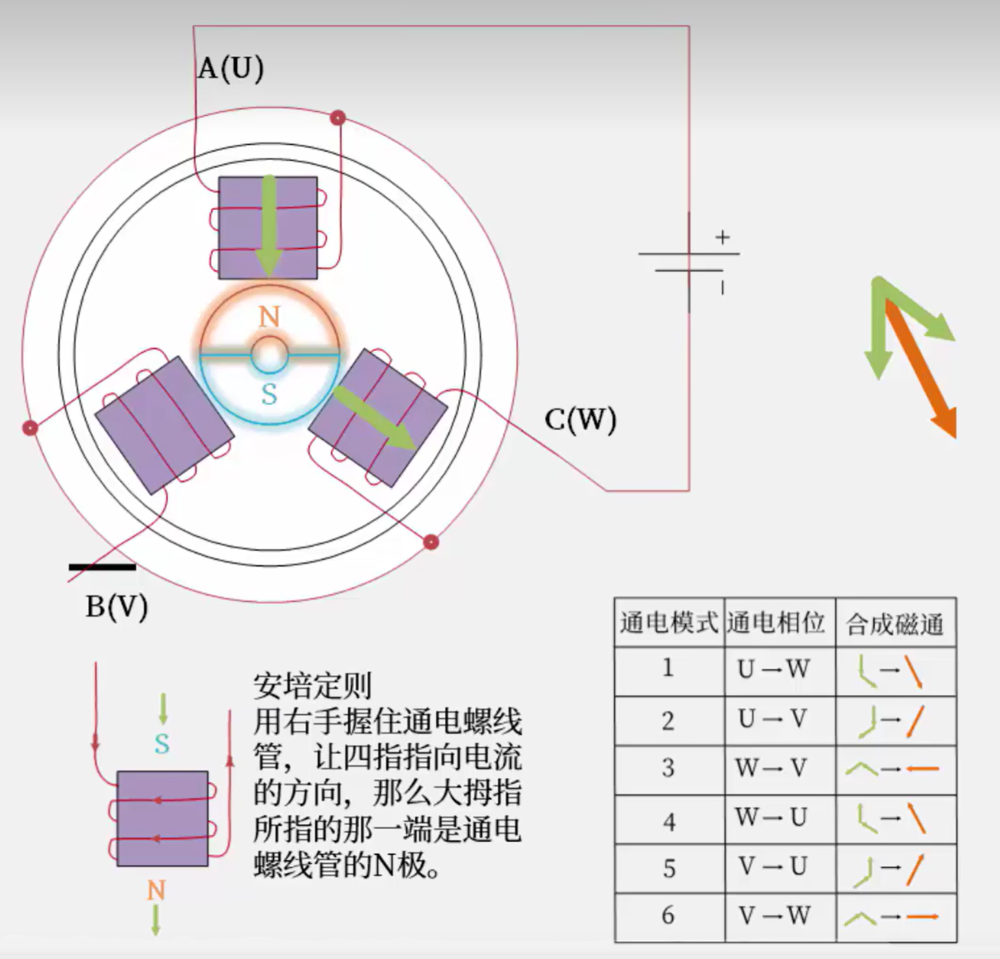

# 无刷直流电机控制

无刷直流电机（`BLDC`）不使用机械换向电刷而直接使用电子换向器的电机，包括：

- 转子：永磁材料
  - 极对数（`Poles`）：转子上永磁体的 `N 极 + S 极` 配对数量，极对数越多，电机在相同转速下的 `电频率` 越高
  - KV 值（rpm/V）:每加 1 伏特电压，电机空载时能达到的转速（转 / 分钟）
- 定子：线圈绕组
  - 相电阻值（`Phase Resistance`）：任意两相绕组之间的电阻，影响电机的启动电流和发热
- 位置传感器

如下图所示：



## 采样

- 位置：常见霍尔传感器或光电传感器。
- 直流电压
- 三相电流

## 换相

六步换相模式：

1. 检测转子位置：霍尔为0<sup>o</sup>、60<sup>o</sup>、120<sup>o</sup>
2. 根据转子位置调节定子绕组电压极性（见原理图中的通电模式）。

## 调速

使用直流电压控制，电压越高转速越快。

目前使用`PWM`（脉宽调制）方式控制，`PWM`占空比越高，等效电压就越高。

## 实际应用

注意：**该项目未验证**

### 硬件及连接

- Arduino UNO
- ESC: Hobbywing Skywalker 30A
- 无刷电机：T-Motor MN2204 2300kV

连线：

- 无刷电机和 ESC ：将 ESC 的三根动力线与电机的三根引线任意连接，如果电机旋转方向与预期相反，交换任意两根动力线的连接
- ESC 与 Arduino 控制信号：
  - 红线（5V 电源）→ 连接到 Arduino 的 5V 引脚（或通过 BEC 供电）
  - 黑线（GND）→ 连接到 Arduino 的 GND 引脚
  - 信号线（白 / 黄）→ 连接到 Arduino 的数字引脚（D9）

### 代码

```c++
/*
  使用Arduino UNO通过ESC控制无刷直流电机的转速和方向
*/

#include <Servo.h>

// 定义ESC控制对象和连接的引脚
Servo esc;
const int escPin = 9;

// 定义方向控制引脚(可选，用于外部开关)
const int directionPin = 2;

// 定义电机速度和方向参数
const int neutral = 1500;    // 中立点(停止)
const int minForward = 1501; // 最小正转信号
const int maxForward = 2000; // 最大正转信号
const int minReverse = 1499; // 最小反转信号
const int maxReverse = 1000; // 最大反转信号

int currentSignal = neutral; // 当前信号值
bool isForward = true;       // 当前方向

// 可选：电位器控制
const int potPin = A0;
bool usePotentiometer = false;

void setup() {
  // 初始化串口通信
  Serial.begin(9600);
  while (!Serial) {}

  // 初始化方向控制引脚
  pinMode(directionPin, INPUT_PULLUP);

  // 连接ESC到指定引脚，设置信号范围
  esc.attach(escPin, maxReverse, maxForward);

  Serial.println("无刷电机控制器(带正反转)初始化中...");
  Serial.println("请确保电机附近没有障碍物!");

  // 初始化ESC (发送中立信号)
  esc.writeMicroseconds(neutral);
  delay(3000); // 等待ESC初始化

  Serial.println("初始化完成!");
  Serial.println("命令列表:");
  Serial.println("  w - 增加速度");
  Serial.println("  s - 降低速度");
  Serial.println("  0 - 停止电机");
  Serial.println("  f - 切换到正转");
  Serial.println("  r - 切换到反转");
  Serial.println("  p - 切换电位器控制模式");
  Serial.println("  ? - 显示当前状态");
}

void loop() {
  // 检查外部方向开关(如果使用)
  checkDirectionSwitch();

  // 检查串口指令
  if (Serial.available() > 0) {
    char cmd = Serial.read();
    processCommand(cmd);
  }

  // 电位器控制模式
  if (usePotentiometer) {
    int potValue = analogRead(potPin);
    controlByPotentiometer(potValue);
    delay(50);
  }
}

// 处理串口命令
void processCommand(char cmd) {
  switch(cmd) {
    case 'w':
      // 增加速度
      if (isForward) {
        currentSignal = constrain(currentSignal + 20, neutral, maxForward);
      } else {
        currentSignal = constrain(currentSignal - 20, maxReverse, neutral);
      }
      setMotorSignal(currentSignal);
      usePotentiometer = false;
      break;
    case 's':
      // 降低速度
      if (isForward) {
        currentSignal = constrain(currentSignal - 20, neutral, maxForward);
      } else {
        currentSignal = constrain(currentSignal + 20, maxReverse, neutral);
      }
      setMotorSignal(currentSignal);
      usePotentiometer = false;
      break;
    case '0':
      // 停止电机
      currentSignal = neutral;
      setMotorSignal(currentSignal);
      usePotentiometer = false;
      break;
    case 'f':
      // 切换到正转
      isForward = true;
      currentSignal = neutral;
      setMotorSignal(currentSignal);
      Serial.println("已切换到正转模式");
      usePotentiometer = false;
      break;
    case 'r':
      // 切换到反转
      isForward = false;
      currentSignal = neutral;
      setMotorSignal(currentSignal);
      Serial.println("已切换到反转模式");
      usePotentiometer = false;
      break;
    case 'p':
      // 切换电位器控制模式
      usePotentiometer = !usePotentiometer;
      if (usePotentiometer) {
        Serial.println("已切换到电位器控制模式");
      } else {
        Serial.println("已切换到串口控制模式");
      }
      break;
    case '?':
      // 显示当前状态
      displayStatus();
      break;
  }
}

// 设置电机信号
void setMotorSignal(int signal) {
  esc.writeMicroseconds(signal);
  Serial.print("设置信号: ");
  Serial.print(signal);
  Serial.print(" (");
  displaySpeedPercentage();
  Serial.println(")");
}

// 通过电位器控制
void controlByPotentiometer(int potValue) {
  // 将0-1023映射到反转最大到正转最大
  currentSignal = map(potValue, 0, 1023, maxReverse, maxForward);
  // 确定当前方向
  isForward = currentSignal >= neutral;
  setMotorSignal(currentSignal);
}

// 检查方向开关
void checkDirectionSwitch() {
  int switchState = digitalRead(directionPin);
  if (switchState == LOW) {
    // 开关闭合，切换到反转
    if (isForward) {
      isForward = false;
      currentSignal = neutral;
      setMotorSignal(currentSignal);
      Serial.println("检测到开关切换，已切换到反转模式");
      delay(500); // 防抖
    }
  } else {
    // 开关断开，切换到正转
    if (!isForward) {
      isForward = true;
      currentSignal = neutral;
      setMotorSignal(currentSignal);
      Serial.println("检测到开关切换，已切换到正转模式");
      delay(500); // 防抖
    }
  }
}

// 显示当前速度百分比
void displaySpeedPercentage() {
  int percentage;
  if (currentSignal > neutral) {
    percentage = map(currentSignal, neutral, maxForward, 0, 100);
    Serial.print(percentage);
    Serial.print("% 正转");
  } else if (currentSignal < neutral) {
    percentage = map(currentSignal, maxReverse, neutral, 100, 0);
    Serial.print(percentage);
    Serial.print("% 反转");
  } else {
    Serial.print("0% 停止");
  }
}

// 显示当前状态
void displayStatus() {
  Serial.print("当前状态: ");
  Serial.print("信号=");
  Serial.print(currentSignal);
  Serial.print(", 方向=");
  Serial.print(isForward ? "正转" : "反转");
  Serial.print(", 速度=");
  displaySpeedPercentage();
  Serial.println();
}
```
